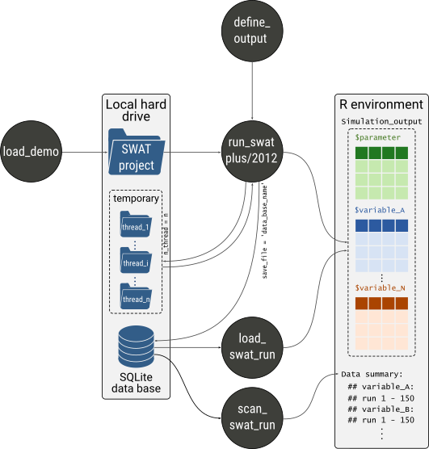

# SWATrunR 


<!---[](https://www.tidyverse.org/lifecycle/#maturing) --->
[](https://doi.org/10.5281/zenodo.2630509)

`SWATrunR` integrates your SWAT2012 and SWAT+ projects in `R` modeling workflows. `SWATrunR`'s key function is to execute SWAT in a project folder located on a hard drive and return simulation results in `R`. Running SWAT models with `SWATrunR` allows the user to control the essential parameters of a simulation run, such as model parameter changes, simulation periods, or time intervals for output printing. The formatting of SWAT simulation outputs in `R` follow the *tidy* data principle. This clear output data structure facilitates an efficient processing of the simulation outputs in any data analysis workflow in `R` and promotes a compatibility with many other `R` packages. `SWATrunR` provides some great features, such as parallel processing to run simulations with different parameter sets in parallel, or incremental writing of simulation outputs to SQLite data bases to store large outputs and safely perform computationally expensive simulation experiments.


## Installation

You can install the `SWATrunR` from the package's GitHub repository: 

```r
# If the package remotes is not installed run first:
install.packages("remotes")

remotes::install_github("chrisschuerz/SWATrunR")
```

`SWATrunR` will be constantly updated and new features will find their way into the `R` package from time to time. Any updates and fixed issues are documented in the [Changelog](https://chrisschuerz.github.io/SWATrunR/news/index.html). Bugs and open issues are documented in the `R` package's [issue section](https://github.com/chrisschuerz/SWATrunR/issues). If you encounter any issues, or want to suggest any new features I encourage you to do so there. Please also check the [closed issues](https://github.com/chrisschuerz/SWATrunR/issues?q=is%3Aissue+is%3Aclosed) to see if your question is related to anything that was already solved before.

## Package workflow

[`run_swatplus()`](https://chrisschuerz.github.io/SWATrunR/reference/run_swatplus.html) and [`run_swat2012()`](https://chrisschuerz.github.io/SWATrunR/reference/run_swat2012.html) are the core `SWATrunR` functions to perform simulations in the SWAT project folder located on the local hard drive and to return the simulation results back to the `R` environment. The simulation outputs that are returned in `R` are defined with the function [`define_output()`](https://chrisschuerz.github.io/SWATrunR/reference/define_output.html). [`define_output()`](https://chrisschuerz.github.io/SWATrunR/reference/define_output.html) translates easily readable output definitions into commands to extract the simulation results from a SWAT+ or a SWAT2012 simulation run, by maintaining the same syntax for both models. [`SWATdata`](https://github.com/chrisschuerz/SWATdata#swatdata-) is an accompanying `R` package that provides SWAT+ and SWAT2012 demo projects that you can instantly start working with `SWATrunR`. With [`load_demo()`](https://chrisschuerz.github.io/SWATrunR/reference/load_demo.html) you can access the SWAT demo projects and other useful demo data such as observation data. With [`load_swat_run()`](https://chrisschuerz.github.io/SWATrunR/reference/load_swat_run.html) and [`scan_swat_run()`](https://chrisschuerz.github.io/SWATrunR/reference/scan_swat_run.html) you can load or just get an overview of SWAT simulations that were stored incrementally in SQLite databases.




## Getting started

The [Get started](https://chrisschuerz.github.io/SWATrunR/articles/SWATrunR.html#loading-demos) page is a good starting point to learn the basics for working with a SWAT project in `R`. It covers the following basics:

- Loading a demo project [>>](https://chrisschuerz.github.io/SWATrunR/articles/SWATrunR.html#figures)
- Performing first SWAT model runs in R [>>](https://chrisschuerz.github.io/SWATrunR/articles/SWATrunR.html#first-swat-model-runs)
- Performing parameter changes in a SWAT run [>>](https://chrisschuerz.github.io/SWATrunR/articles/SWATrunR.html#model-parameter-alteration)
- Saving and loading SWAT simulations [>>](https://chrisschuerz.github.io/SWATrunR/articles/SWATrunR.html#saving-and-loading-simulations)
- A short overview of further `run_swat*()` input arguments [>>](https://chrisschuerz.github.io/SWATrunR/articles/SWATrunR.html#further-SWATrunR-input-arguments)

The [Reference pages](https://chrisschuerz.github.io/SWATrunR/reference/index.html) document all functions of `SWATrunR` and provide descriptions of the function input arguments and short examples on how to use the functions. 

Additional materials on the usage of `SWATrunR` and short tutorials how you can integrate `SWATrunR` in typical SWAT modelling workflows will be added in the [Articles](https://chrisschuerz.github.io/SWATrunR/articles/) section over time.
